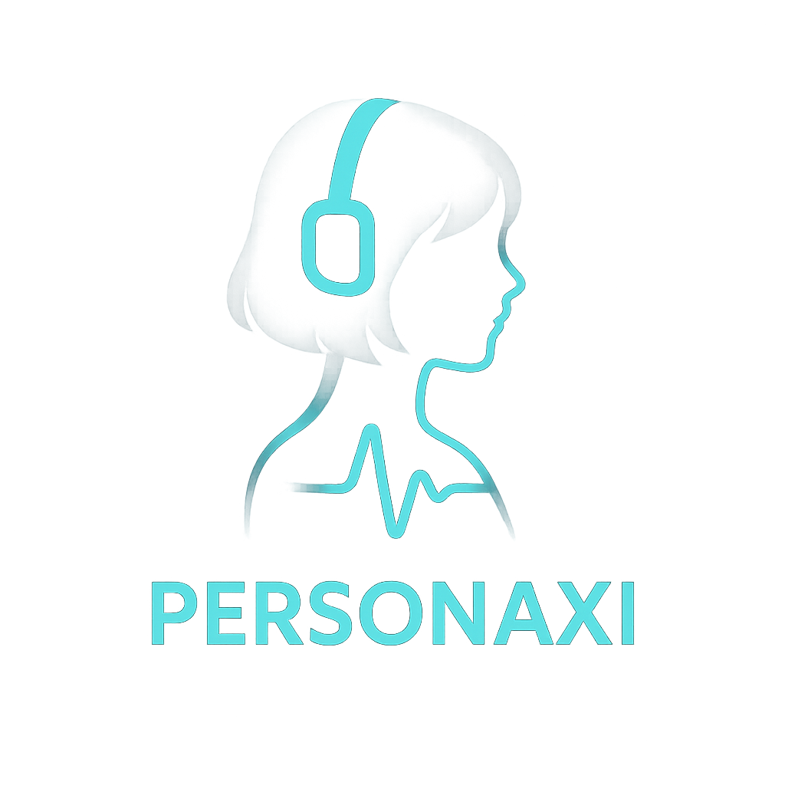

  
  
  # 🎭 PersonaXi
  
  ### VRM 3D Characters? Live2D 2D Characters? 
  ### Chat with both in one place with AI! 🔥

  [🇺🇸 English](README.md) | [🇰🇷 한국어](README.ko.md)
  
   

  
  
  
  ---
  
  **"What if you could actually talk to your favorite characters?"**
  
  PersonaXi is the only AI character chat platform that supports  
  **Real-time Voice Conversations** with both 3D and 2D characters.
  

---

## 🔥 Looking for this?

### ✨ Create a VTuber AI Assistant
- Add AI to your VTuber character and let it chat with fans 24/7
- Just upload your VRM file
- Customize voice, tone, and personality

### 💬 Chat with Favorite Characters
- Both 2D illustrations and 3D models come to life
- "How was your day?", "Listen to my worries" - anything goes
- Voice Support - Characters speak directly to you

### 🎨 Create & Share Your Character
- Upload models created with VRoid directly
- Live2D illustrations are also supported
- Earn creator rewards if your character becomes popular

---

## 💎 Why PersonaXi?

| Others | PersonaXi |
|-----------|-----------|
| Text Only | ✅ **Voice Conversation Support** |
| 2D OR 3D | ✅ **Both 2D + 3D** |
| Fixed Characters | ✅ **Create Your Own** |
| English Only | ✅ **Full Korean/English Support** |
| Simple Chatbot | ✅ **Expressions + Animations** |

---

## 🌟 Top 3 Popular Characters

### 1. 🎨 Live2D Cat Girl "Peroyang"
> "Meow~ Will you play with me today?"

- 2D Live2D Animation | Cute Tone
- Loves games and anime
- [Chat Now →](https://personaxi.com/profile?c=ae3f9f53-3e90-4cab-9edd-7369116007b8)

### 2. High School Girl "Ranella"
> "Hello~ How are you feeling today?"

- 3D VRM Model | Bright & Positive Personality
- From daily chat to counseling
- [Chat Now →](https://personaxi.com/profile?c=10c94bb4-f0cf-4b36-a6cd-d00685745d65)

### 3. Boyfriend & Girlfriend Characters
> Erica | "How was your day?"
> Dmitri | "What are you up to?"

- Chat with male/female characters!
- [Chat Now (Erica) →](https://personaxi.com/profile?c=50e4c4ca-7e41-4561-9d46-2cb513a6bf73)
- [Chat Now (Dmitri) →](https://personaxi.com/profile?c=6acbce00-12f4-4c68-b064-936ba7ba2469)

[See More Characters →](https://personaxi.com/hub)

---

## 🎁 Join Now

- ✅ First Character Creation **FREE**
- ✅ Daily Chat Credits **FREE Refill**
- ✅ Unlimited Trial of Popular Characters (Limited Time)

  

---

## 💬 User Reviews

> "Feels like talking to a real character! The voice gave me goosebumps."  
> ⭐⭐⭐⭐⭐ - VTuber aspirant KimOO

> "Uploaded my VRoid model and it moved instantly. No coding needed."  
> ⭐⭐⭐⭐⭐ - 3D Modeler LeeOO

> "Struggled to find a place that supports both Live2D and VRM, found the answer here."  
> ⭐⭐⭐⭐⭐ - AI Chat User ParkOO

---

## 🎓 Start in 5 Minutes

### Step 1: Choose or Create
- Try popular characters OR
- Create your own (Upload VRM/Live2D)

### Step 2: Set Personality
- Input tone, personality, interests
- AI automatically generates the persona

### Step 3: Start Chatting!
- Chat with text or voice
- Characters react in real-time

---

## ❓ FAQ

<b>Is it free?</b>

 
Basic features are free!  
- Get free Neurons (chat credits) upon signup!
- Unlimited character creation!

<b>What file formats are supported?</b>

 
- **VRM** (VRoid Studio, Vket, etc.)
- **Live2D** (.model3.json)
- PNG/JPG Illustrations (AI auto-animation coming soon)

<b>Can I use it commercially?</b>

 
Creators can earn points!
Please check the [Terms of Service](link) for details.

---

## 🔗 Links

- 🌐 [PersonaXi Website](https://personaxi.com)
- 💬 [Discord Community](#)
- 📺 [YouTube Tutorial](#)
- 📸 [Instagram Showcase](#)
- 🐦 [X (Twitter)](#)

---

  
  ### 🚀 Start Right Now!
  
  
  
    
  
  
  💌 Contact: contact@personaxi.com
  
  
    
  
  
  

---

## Credits & Licenses

This project uses the following open-source software and proprietary technologies:

- **Live2D Cubism SDK** (Proprietary License) - Copyright (c) Live2D Inc.
- **Three.js** & **@pixiv/three-vrm** (MIT License)
- **Svelte** & **SvelteKit** (MIT License)
- **FFmpeg** (LGPL/GPL)

For a full list of third-party licenses, please refer to the [Licenses Page](src/lib/i18n/locales/en/licenses.md) or the in-app menu.
